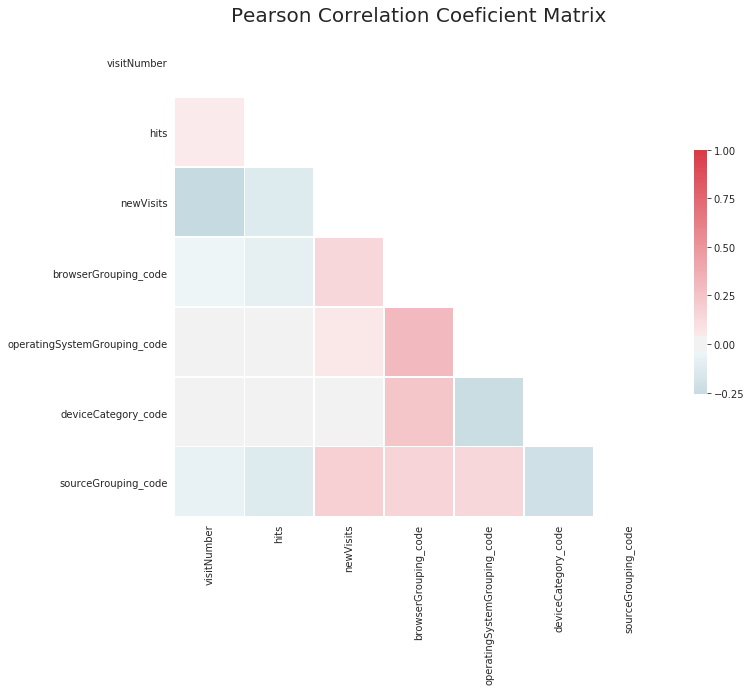

# Google Store Customer Conversion Study

## Jasmine He

# Introduction
Understanding customer purchase behavior is highly useful for strategic planning and decision-making processes that lead to the company’s future success and growth.

Google published their online store data on Kaggle to collect ideas on how to use their data to best predict customer behavior. This project is to use machine learning models to determine if each customer visiting Google merchandise store is likely to make a purchase or not.  

# Data Overview
### - Total of 0.9 million visits from 2016-08 to 2017-07
### - Total of 50 different features
### - Main feature categories:
####  1) Device feature: browser, operating system, isMobile, etc.
####  2) Source feature: channel, medium, referral path, etc
####  3) Geography feature: city, country, region, continent, etc
####  4) Behavior feature: visits, hits, pageviews, bounces, visitStartTime etc
####  5) Transaction feature: transaction revenue

# Data Preprocessing
## Step 1. Data Cleaning

Here is how the missing data summary look like before cleaning.

Around 10% of the data is missing. After looking at the features with missing data more closely, most of them use NAN to represent 0. The best simplified method is to replace the missing values for those features (bounces, transaction revenue, isTureDirect) with 0.

Notice there are some unnecessary features in our data set, it is optimal to drop those unnecessary features and keep only the useful ones for our model.  

Below graph shows what our data looks like after cleaning unnecessary features and plugging in 0s for NANs.

## Step 2. Data Transformation
### 1) Categorize below features:
Browser, Operating System, Source
### 2) Encode below categories:
Channel Grouping, Device Category, Continent, Browser Grouping, Operating System Grouping, Source Grouping

# Exploratory Data Analysis
EDA is the statistical way of storytelling with data.  We will explore data, find patterns, and observe insights using EDA.

## 1. Key Metrics by Channel Type

We can see that display advertising has the highest expected revenue per visitor.  It's also one of the most difficult methods, having a very low number of total visits.  Conversely, social media brings a large number of visits, but a very low conversion rate (average revenue).

We can immediately see that, for a large total revenue, we need a balance of high visitation and high conversion rate per visitor.  Referrals give the best balance; direct advertising and organic search yield high total revenues as well.

## 2. Key Metrics by Browser

We can see from the Average Revenue graph that there's the highest expected revenue from Chrome and Firefox users.  Although Firefox slightly edges out Chrome in Average Revenue per visitor, there are far more users using Chrome, making Chrome users the highest revenue-generating customer group in total.

## 3. Key Metrics by Device

It is clear that majority of store visits are done on a desktop, and the desktop also has the highest conversion rate.  Clearly, desktop visits yield the vast majority of total revenue.

## 4. Key Metrics by Operating System

Operating system data paints a more detailed picture of revenue-by-device.  We already know that the desktop yields the vast majority of revenue, which eliminates iOS and Android as major revenue sources.

Chrome OS has a very high conversion rate, but a very low usage rate, which makes sense as Chromebooks are a niche Google product.

Macintosh users have a fairly high conversion rate for using a non-niche operating system, so Mac desktops yield the highest total revenue.

## 5. Key Metrics by Continent

The key metric here is the dominance of American (including South and Central America) conversion rate and visitation numbers.  We can speculate most of these numbers come from the United States, which was confirmed by a separate data field (City).

## 6. Key Metrics by Medium

Similar to the channel analysis, most revenue comes from referrals and organic search.  Direct advertising is bucketed under (none) because these graphs only describe how customers are advertised through online marketing methods.

# Machine Learning Modeling

## 1. Feature Selection

### 1)  Pair Plot Visualization

### 2)  Pearson Correlation Coefficient Matrix - Original Features

### 3)  Variance Inflation Factors (VIFs)

By running the ReduceVIF function, we can drop the features with VIF >= 5. Below is the screenshot of the output.

### 4)  Pearson Correlation Coefficient Matrix - Reduced Features

## 2. Logistic Regression

### Option 1. Unbalanced Model

Th normalized true positive is 0.999, but the normalized true negative is only 0.048, which is very low. For our prediction model, we aim to have high true negative (purchase/purchase), but this unbalanced model does not work well on it. The main reason is the majority of the visits are non-purchases (about 1% of visits result in a purchase). In order to improve our model, we are going to build a logistic regression model on the balanced model.

### Option 2. Balanced Model

The balanced model works very well, since both the normalized true positive and the normalized true negative are very high (0.941, 0.9397 respectively).

## 3. Principle Component Analysis
### Option 1. Unbalanced Model

### Option 2. Balanced Model

## 4. K-Means Clustering
### Option 1. Unbalanced Model

### Option 2. Balanced Model

# Conclusion

Let's compare the precision score of Logistic Regression model and the K-Means Clustering model used above.

From the above table, we can see that Logistic Regression on the unbalanced model has the highest precision score (0.94).

# Discussion
