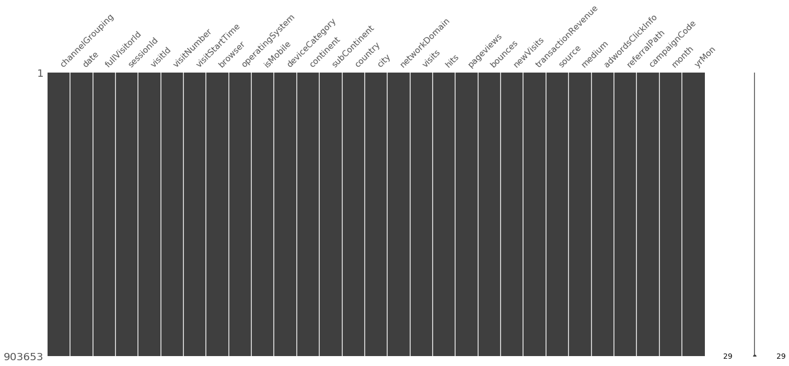
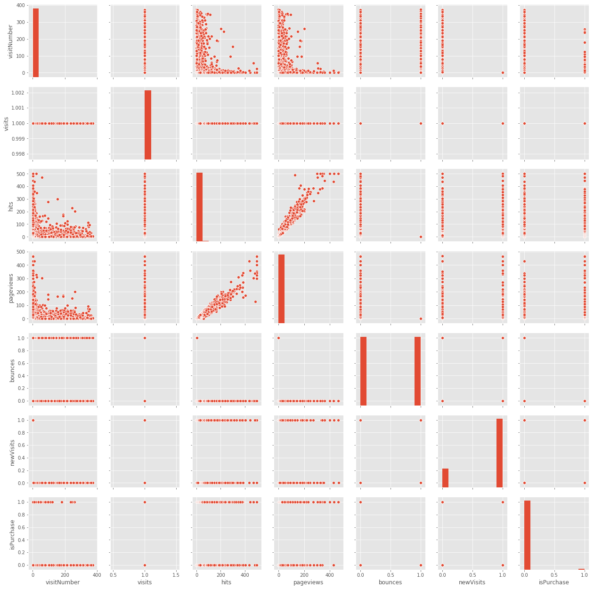
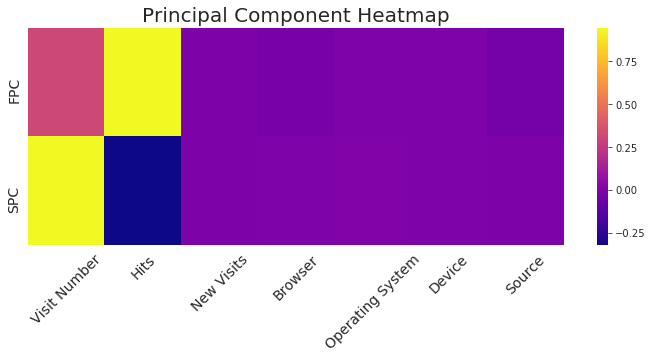

# Google Store Customer Purchase Behavior Prediction

## Jasmine He

# Introduction
Understanding customer purchase behavior is highly useful for strategic planning and decision-making processes that lead to the company’s future success and growth. This project is to use machine learning models to determine if each customer visiting Google merchandise store is going to make a purchase or not.

# Data Overview
### - Total of 0.9 million visits from 2016-08 to 2017-07
### - Total of 50 different features
### - Main feature categories:
1) Device feature: browser, operating system, isMobile, etc.
2) Source feature: channel, medium, referral path, etc
3) Geography feature: city, country, region, continent, etc
4) Behavior feature: visits, hits, pageviews, bounces, visitStartTime etc
5) Transaction feature: transaction revenue

# Data Preprocessing
## 1. Data Cleaning

Here is how the missing data summary look like before cleaning.

Around 10% of the data is missing. After looking at the features with missing data more closely, most of them use na to represent 0. The best simplified method is to replace the missing values for those features (bounces, transaction revenue, isTureDirect) with 0.

Notice there are some unnecessary features in our data set, it is optimal to drop those unnecessary features and keep only the useful ones for our experiment.

Below graph shows how clean our data is.

## 2. Data Transformation
### 1) Categorize below features:
Browser, Operating System, Source
### 2) Encode categorical below features:
Channel Grouping, Device Category, Continent, Browser Grouping, Operating System Grouping, Source Grouping

# Exploratory Data Analysis
EDA is statisticians way of story telling where you explore data, find patterns and tells insights.

## - Channel Distribution

## - Browser Distribution

## - Device Distribution

## - Operating System Distribution

## - Continent Distribution

## - Medium Distribution

# Machine Learning Modeling

## Step 1. Feature Selection

### 1) Pair Plot Visualization

### 2) Pearson Correlation Coeficient Matrix

### 3) Variance Inflation Factors (VIFs)

????? need a vif pic

## Step 2. Logistic Regression

### 1) Unbalanced Model
 

### 2) Balanced Model

## Step 3. Principle Component Analysis
### 1) Unbalanced Model

### 2) Balanced Model

## Step 4. K-Means Clustering

## Step 5. Model Comparison

Let's compare the accuracy score of Logistic Regression model and the K-Means Clustering model used above.

From the above table, we can see that has the highest precision score.
